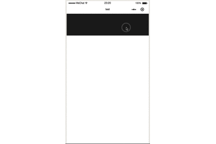

## 微信小程序 wepyjs 第三方slide-card组件




### 说明

1.0版本暂不支持滑块跟随手指移动，该功能将在后面开发。

### 使用

#### 安装组件

```shell
npm install wepy-slide-card --save
```

#### 引入组件

```javascript
<template>
  <SlideCard :constantFlex="a" :slideFlex="b"></SlideCard>
</template>

<script>
import wepy from 'wepy'
import SlideCard from 'wepy-slide-card'

export default class Index extends wepy.page {
  data = {
    a: 5,
    b: 1
  }
  components = {
    SlideCard
  }
}
</script>
```

#### 使用方法

需要分别传入``constantFlex`` ``slideFlex``给滑块分别作为左侧固定滑块和右侧显隐滑块的宽度，两者是比例关系（flex），